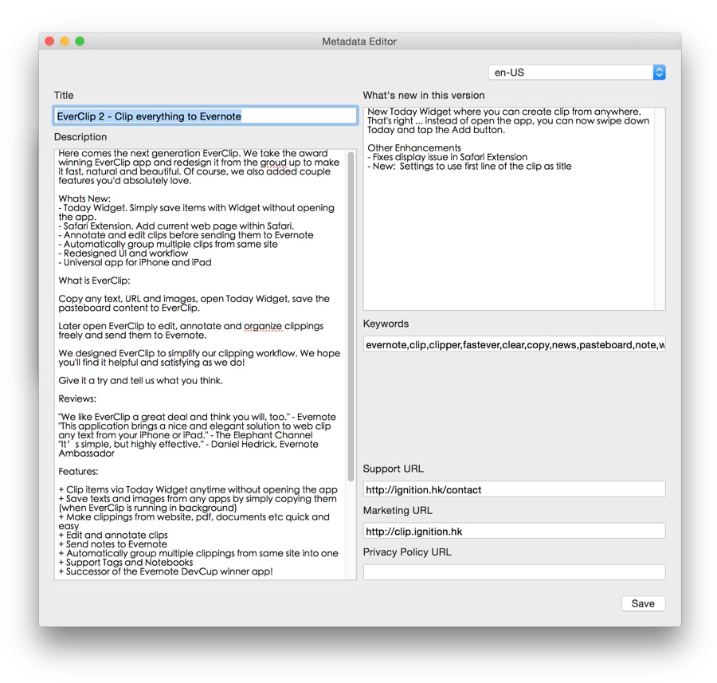

# Deliver.app

An app to upload screenshots and metadata to App Store. A frontend for [deliver](https://github.com/krausefx/deliver). 

## Why?

If you use [deliver](https://github.com/krausefx/deliver) to manage your App Store metadata, you're probably happy to update metadata in batch, **version control** them, and integrate them into your CI. The problem is, editing a large JSON file manually is not a pleasant task. Deliver.app is build to solve this problem.

## Features

Currently the app only does one thing: edit deliver ``metadata.json``. (You'd still have to upload the file via command line)

## Installaa

- Download the [prebuild binary](http://cl.ly/2v1g1n3w2w0r)
- Or clone the project and build yourself.

## Build

- Xcode 7 beta 4

## Todo

- Screenshots management.
- Embed the ruby gems into the app (?)

## License

This project is licensed under the terms of the MIT license. See the LICENSE file.

> This project and all fastlane tools are in no way affiliated with Apple Inc. This project is open source under the MIT license, which means you have full access to the source code and can modify it to fit your own needs. All fastlane tools run on your own computer or server, so your credentials or other sensitive information will never leave your own computer. You are responsible for how you use fastlane tools.
